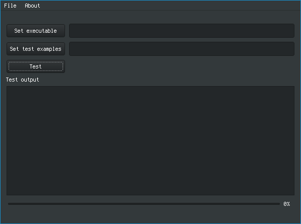
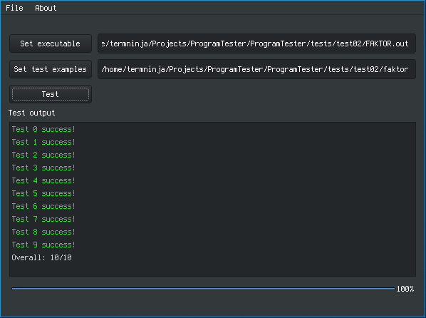

# Tony Tester

## Description

## Usage
- Choose *Set executable* to choose executable of the program you are testing
- Choose *Set test examples* to choose directory with input/output test examples

Check folder **tests** to see the structure of test examples.

## Required for building:
- Qt5 base
- C++ compiler, at least c++11

## Screenshots

